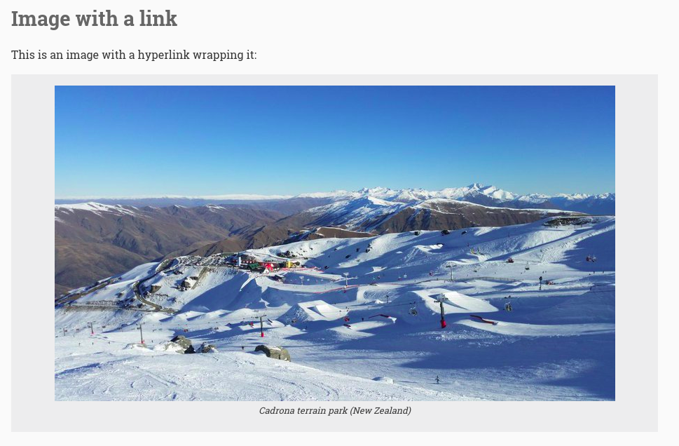
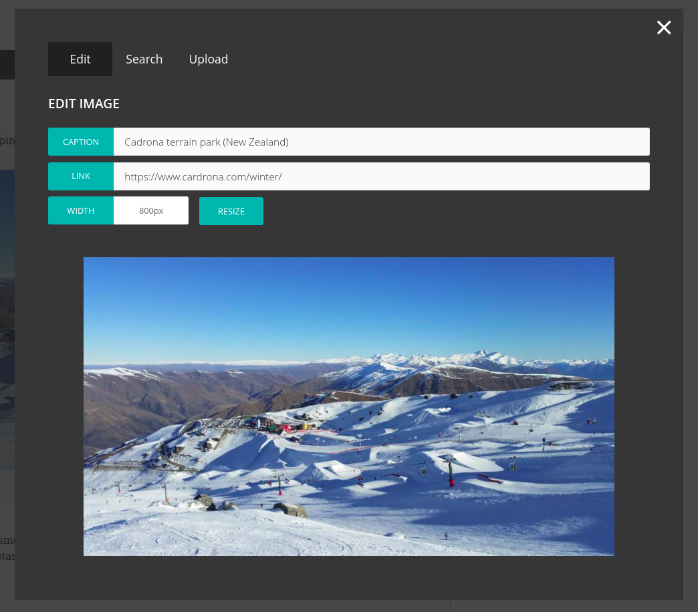

# Wagtail News Image

This [Django](https://www.djangoproject.com/) app provides an inline image block for the Draftail WYSIWYG editor.

You can play with this plugin on a demo site [here](https://github.com/MattSegal/wagtail-news-image-demo).

This image block supports:

- upload
- search
- resize
- captions
- hyperlinks

This is what the image block looks like in the Draftail WYSIWYG editor:



Clicking on the block reveals a modal, which allows you to edit the image:



## Installation

In `settings.py` you need to register the app in `INSTALLED_APPS`

```python
# settings.py

INSTALLED_APPS = [
  # ...
  'wagtailnewsimage',
  # ...
]
```

In `urls.py` you need to add `wagtailnewsimage.urls`. The base url (`wagtailnewsimage/`) can be configured to be whatever you like.

```python
# urls.py
urlpatterns = [
  # ...
  path(r'wagtailnewsimage/', include('wagtailnewsimage.urls')),
  # ...
]
```

In `models.py` you need to add `news-image` to your RichTextField features whitelist

```python
# models.py

class MyPage(Page):
    body = RichTextField(features=[
        # ...
        'news-image',
        # ...
    ])
```

## Dependencies

* Wagtail (2+)
* Django (1.11+)
* Django Rest Framework (3+)
